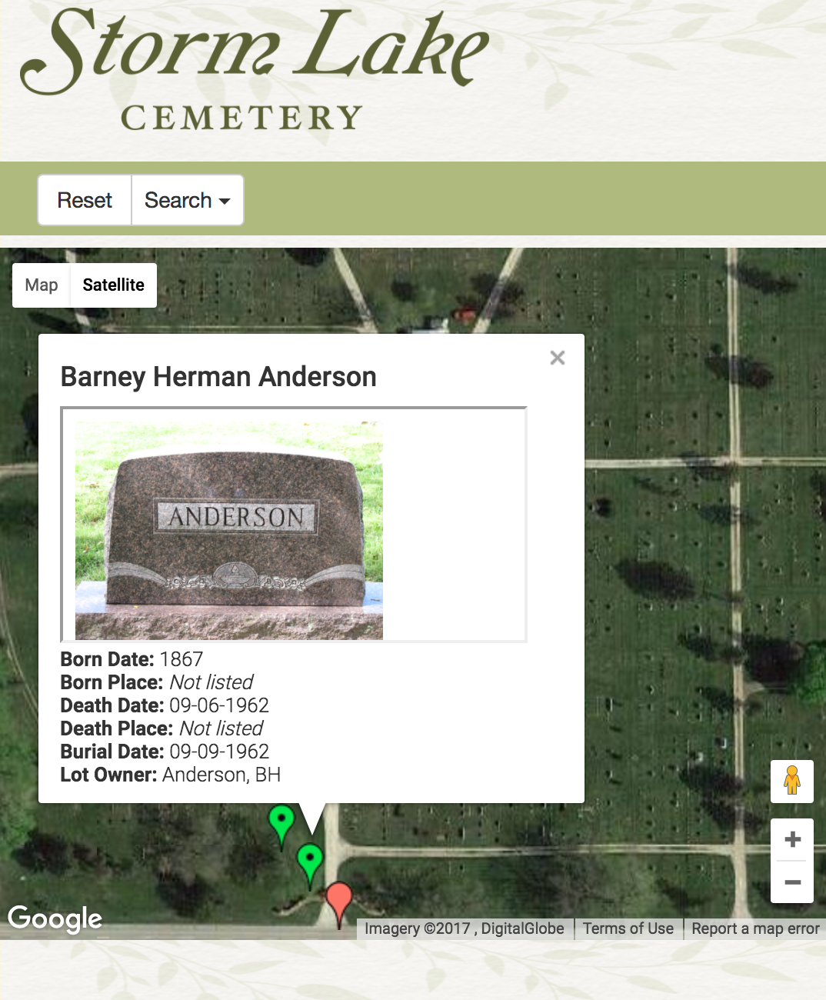

cemetery-map
============
The cemetery-map Web application is a responsive Python+Flask+SQLAlchemy+Google
Maps app that allows people to search for loved ones in a cemetery.  This
application is a Flask rewrite of a previous Node.js app written by
[jbshep](http://github.com/jbshep) and his students, which was designed
specifically for the cemetery in Storm Lake, Iowa, U.S.A.

## Installation

Those interested in contributing code are encouraged to use virtualenv to
manage their Python version, site-packages, and environment variables.  Once a
virtual environment is created in `env`, developers may wish to create a script
file that can be sourced, like this.

```console
source env/bin/activate
export APP_SETTINGS="config.DevelopmentConfig"
export DATABASE_URL="postgresql://localhost/cemdb"
```

To begin installation of the app, you must first install PostgreSQL and add
PostgreSQL's bin directory to your path.  Run psql and type the command `create
database cemdb;`  You can then build and run the app as follows:
```console
pip3 install -r requirements.txt
python3 manage.py db upgrade
python3 manage.py runserver
```
If you did not add PostgreSQL's bin directory to your path prior to executing
the above commands, you will likely see the error `Error: pg_config executable
not found.`

## Contributing

BVU students interested in contributing should write code that conforms to the
[PEP8](https://www.python.org/dev/peps/pep-0008/) coding standards.  Developers are encouraged to use GitHub's fork/pull request mechanism for contributing to this repository.
